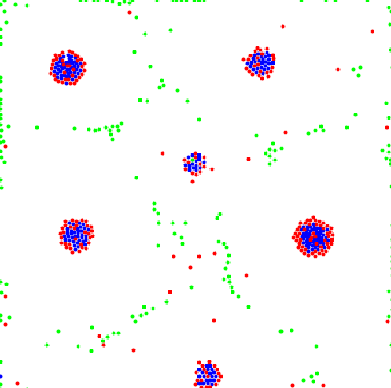

# particle-life

## About
An implementation of [Tom Mor's Particle Life](https://youtu.be/p4YirERTVF0) in Clojure. It was made using Quil and based on the [attraction repo](https://github.com/kibonusp/attraction) and the [Noite de Processing's video](https://www.youtube.com/live/_AgE_akJWuk?feature=share) from Garoa Hacker Clube.

https://github.com/kibonusp/particle-life/assets/61764803/205ed53c-869e-4cf2-9c0b-e84d58861836

## Usage

Run `lein run` on the terminal with [Leiningen](https://leiningen.org/) installed.

If you have Java installed, you can also run the standalone with `java -jar target/particle-life-0.1.0-SNAPSHOT-standalone.jar`.git

https://github.com/kibonusp/particle-life/assets/61764803/753e61dd-eff7-4676-992c-bbc4ab96af9f

